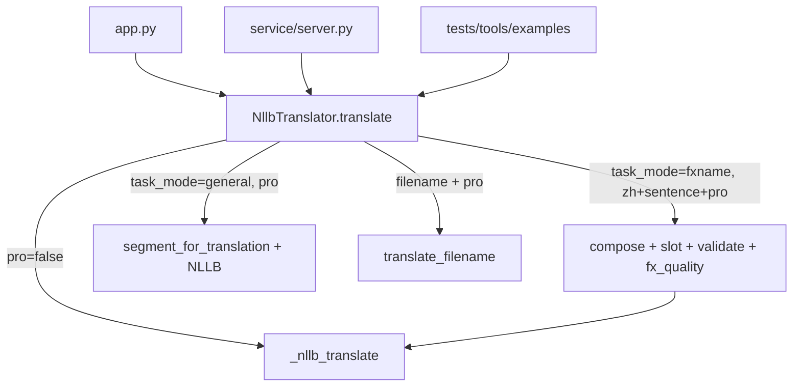

# FXName Mode Boundary 0.1 — 翻译入口与模式边界

阶段：**SD FXName Mode Boundary 0.1**

本文档梳理 SoundDesign Translater 中所有翻译入口，说明 **General / 普通翻译** 与 **FXName / 音效命名** 的边界、当前默认行为与建议默认行为。

---

## 1. 模式定义

| 模式 | API `task_mode` | 适用场景 | 中→英行为 |
|------|-----------------|----------|-----------|
| **FXName / 音效命名** | `fxname` | 声音素材名、FXName、Soundminer/UCS 命名 | `compose_zh_to_en` → slot 组装 → Boom 风格 → `validate_fx_name` + `evaluate_fx_output`；NLLB 仅补 unknown 片段，**不信任整句 NLLB** |
| **General / 普通翻译** | `general` | 句子、说明文本、自然语言 | 术语分段 + NLLB 补洞（`segment_for_translation`），**不走 FXName 管线** |

路由参数 `mode`（auto / sentence / filename）仍然控制**英→中文件名** vs **句子** 的自动识别，与 `task_mode` 正交：

- `task_mode=fxname` + 中文句子 → FXName 管线
- `task_mode=general` + 中文句子 → 普通句子管线
- 英→中文件名（`filename`）两种 task_mode 行为相同

---

## 2. 翻译入口一览

### 2.1 GUI

| 入口 | 文件 | 当前行为 | 建议行为 |
|------|------|----------|----------|
| **FXName Review UI** | `fxengine/ui.py` | Normalize + Token Review + Personal Dictionary | ✅ 当前双击入口 |
| **Translate / 翻译** 按钮 | `app.py` | 用户选择 **任务 Task**（默认 FXName）+ 路由 Mode + Pro | ✅ 已实现 |
| 启动脚本 | `启动翻译工具.bat` | `pythonw -m fxengine.ui` | 当前默认 |

**双击入口默认：** FXName Normalize；旧版完整翻译 GUI 仍可用 `python app.py` 启动。

### 2.2 HTTP 服务

| 入口 | 文件 | 参数 | 默认 |
|------|------|------|------|
| `POST /translate` | `service/server.py` | `text`, `mode`, `pro_mode`, **`task_mode`** | `task_mode=fxname` |
| `GET /health` | `service/server.py` | — | — |
| 启动脚本 | `start_translate_service.bat` | — | — |

### 2.3 Python 客户端

| 入口 | 文件 | 方法 |
|------|------|------|
| HTTP 封装 | `client/python/client.py` | `LocalTranslateClient.translate(..., task_mode="fxname")` |

### 2.4 核心引擎 API

| 入口 | 文件 | 说明 |
|------|------|------|
| **主入口** | `engine.py` | `NllbTranslator.translate(..., task_mode=TaskMode.FXNAME)` |
| **FXName 专用** | `engine.py` | `NllbTranslator.translate_fxname(text, ...)` |
| **普通翻译专用** | `engine.py` | `NllbTranslator.translate_general(text, ...)` |
| CTranslate2 底层 | `engine.py` | `_nllb_translate()` → `translate_batch([tokens], ...)`，batch=1，非对外 API |

### 2.5 CLI / 示例

| 入口 | 文件 | 当前 task_mode |
|------|------|----------------|
| UCS 集成示例 | `examples/ucs_renamer_demo.py` | 未传（HTTP 默认 fxname） |
| 文档 spot-check | `docs/补词批量验收指南.md` | 未传（引擎默认 fxname） |

### 2.6 测试与质量脚本

| 入口 | 文件 | task_mode |
|------|------|-----------|
| 全量体验测试 | `tests/run_all_tests.py` | 默认 fxname（中→英 FX 用例） |
| FX 矩阵 | `tests/test_fx_name_matrix.py` | 直接测 compose，不经 translate |
| Boom 索引 | `tests/test_boom_style_index.py` | `mode=sentence`（引擎默认 fxname） |
| **模式边界回归** | `tests/test_fxname_mode_boundary.py` | 显式 general / fxname |
| FX 质量评估器单测 | `tests/test_fx_quality_evaluator.py` | 不测 engine |
| Smoke 真实用例 | `tools/run_smoke_real_cases.py` | `mode=sentence, pro_mode=True`（默认 fxname） |
| **质量 Harness** | `tools/evaluate_fxname_quality.py` | 显式 `task_mode=fxname` |
| zh_compose 单测 | `tools/test_zh_compose.py` | 不经 engine |

### 2.7 非翻译入口（排除）

- `build_glossary.bat` / `glossary/build_glossary.py`
- `tools/find_uncovered_terms.py` / `tools/export_uncovered_batches.py`
- `tools/build_boom_style_index.py`
- **UCSRenamer**（本阶段未修改）

---

## 3. 哪些入口是普通翻译 vs FXName

### 应该是 **General / 普通翻译**

- 用户明确选择 GUI「General / 普通翻译」
- API `task_mode=general` 或 `translate_general()`
- 长说明句、对话、非命名用途的中英互译

### 应该是 **FXName / 音效命名**

- GUI 默认「FXName / 音效命名」
- API 默认 `task_mode=fxname` 或 `translate_fxname()`
- `tools/evaluate_fxname_quality.py`
- `tools/run_smoke_real_cases.py`（音效命名 smoke）
- `tests/run_all_tests.py` 中「中→英·FX」类用例
- UCS / Soundminer 素材重命名场景

### 英→中文件名

- 两种 task_mode 均走 `translate_filename()`，与 FXName 边界无关

---

## 4. 当前 vs 建议默认行为

| 层级 | 改动前 | 改动后（0.1） |
|------|--------|---------------|
| 引擎 `translate()` | 中文+sentence+pro → **隐式** FX 管线 | `task_mode` 显式控制；默认 `fxname` |
| GUI | 无任务区分；中文自动走 FX | 任务选择器，默认 **FXName** |
| HTTP | 无 `task_mode` | `task_mode` 默认 **fxname** |
| 质量展示 | GUI 不显示 quality/issues | FXName 模式显示 Quality / Issues |
| NLLB 信任 | 整句 fallback 可能产出口语脏短语 | FXName 模式：脏短语检测 + `nllb_candidate_rejected` 标注 |

---

## 5. 质量字段（FXName 模式 `debug`）

| 字段 | 说明 |
|------|------|
| `quality` | `pass` / `needs_review` / `fail`（来自 `evaluate_fx_output` + 引擎门禁） |
| `issues` | 统一 issue 名：`bad_phrase`、`sentence_like_output`、`unknown_zh`、`mixed_language_residue`、`empty_output`、`too_long`、`over_expanded`、`spacing_suspect`、`duplicate_token`、`nllb_candidate_rejected` |
| `matched_bad_phrases` | 检测到的脏短语 |
| `rejected_candidates` | 被过滤的 NLLB 候选片段列表（原始文本，debug 用） |
| `structural_quality` / `structural_issues` | `validate_fx_name` 结构校验（含 `low_information`、`missing:*` 等，不并入对外 `issues`） |

空输出 → `quality=needs_review`，不假装成功。

---

## 6. 调用关系

---

## 7. 硬性边界（本阶段）

1. ✅ 不破坏 General 模式下的普通句子翻译
2. ✅ FXName 模式不把整句 NLLB output 当 gold
3. ✅ 未修改 UCSRenamer
4. ✅ GUI 轻量任务开关，非大重绘
5. ✅ `translate_fxname()` / `translate_general()` 为后续核心 Agent 接入预留边界

---

## 8. 相关文件

- 引擎：`engine.py`（`TaskMode`, `translate_fxname`, `translate_general`）
- GUI：`app.py`
- 服务：`service/server.py`, `client/python/client.py`
- 质量：`glossary/fx_quality.py`, `glossary/fx_name.py`
- 回归：`tests/test_fxname_mode_boundary.py`
- 报告：`tests/results/fxname_hardening_report.md`
