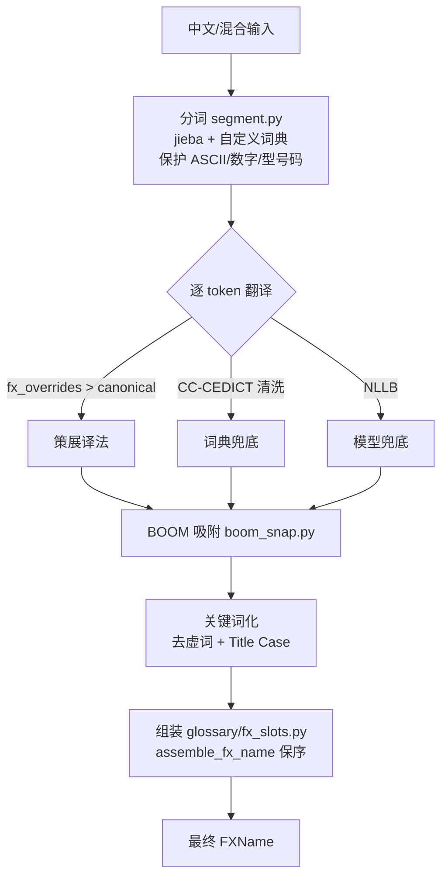

# Translator 架构（离线混合翻译引擎）

> 记录日期：2026-06-28
> 模块：`translator/`
> 定位：NLLB 打底 + CC-CEDICT 兜底 + BOOM 风格吸附的离线翻译工具

---

## 1. 为什么新建这个模块

旧的 FXName 确定性词表流水线（`fxengine`）在 BOOM ONE 1000 对中英 FXName 上
token-F1 仅 **0.108**、集合完全匹配 **0/1000**：纯词表「最长匹配」追不上开放词汇
（专有名词、长尾设备），连 `奥古斯塔→Augusta`、`A109`、`01` 都丢失；且无分词器，
「喷火器」被逐字拆成 `喷/火/器`。

新引擎在同一语料上 token-F1 **0.698**、集合完全匹配 **134/1000**（约 6.5×），
且「喷火器→Flamethrower」「奥古斯塔 A109 飞走 01→Augusta A109 Fly Away 01」正确。

---

## 2. 四种能力（统一入口 `translator/api.py`）

| 能力 | 函数 | 实现 |
|------|------|------|
| 1. 中文/混合 → FXName 关键词英文 | `to_fxname` | `fxname_mode`（分词+词典+吸附） |
| 2. 英文 → 中文（词/句） | `en_to_zh` | 复用 `engine.py` NLLB + glossary 术语保护 |
| 3. 中文 → 英文整句（写 metadata） | `zh_to_en` | 裸 NLLB（比 en→中 管线更干净） |
| 4. 英文长句 → 中文 | `en_to_zh` | 同能力 2 |

---

## 3. 模式1 管线（核心）



逐 token 翻译优先级：`fx_overrides`（策展）> `canonical_tokens.csv`（keep，只读）
> CC-CEDICT（清洗后）> NLLB（兜底）。

---

## 4. BOOM 风格吸附（用户核心诉求）

翻译候选拿到 BOOM 全库（`glossary/boom_style_index.sqlite`，81k fx_records /
363k 短语，带词频）比对：

| 情况 | 处理 |
|------|------|
| 候选已是 BOOM 常见写法（freq 达阈值） | 保留 |
| 不常见，但有更常见「形变体」（拼写/空格/单复数/-ing） | 吸附（`flame thrower→Flamethrower`） |
| 不常见，但对齐表有更常见「同义 BOOM 写法」且符合中文输入 | 吸附（按词重叠+频次择优） |
| 否则 | 保留模型/词典输出 |

「符合中文输入」由 `translator/data/zh_en_alignment.csv` 把关（zh_token→合法英文集合），
避免同义替换改错语义。

---

## 5. 资源文件

| 文件 | 说明 | 生成方式 |
|------|------|----------|
| `translator/data/jieba_userdict.txt` | 分词词典（cedict 词头 ∪ canonical zh） | `python -m translator.segment --build` |
| `translator/data/zh_en_alignment.csv` | 中英对齐证据（canonical+candidates+cedict） | `python -m translator.align` |
| `translator/data/fx_overrides.csv` | 小型策展覆盖层（修正 cedict 误义、统一 BOOM 写法） | 手工维护 |
| `glossary/boom_style_index.sqlite` | BOOM 全库词频（已存在） | `tools/build_boom_style_index.py` |
| `nllb_int8_model/` | NLLB-200 int8 权重 | Release 下载 |

---

## 6. 自验收

```powershell
python tools/eval_translator.py            # 1000 对 token-P/R/F1，输出 reports/translator_eval_*.md
python tools/quick_fxname_smoke.py         # 开发期快速冒烟，并排看每 token 决策
```

当前基线：新引擎 **F1=0.698 / exact=134** vs 旧 **F1=0.108 / exact=0**。

---

## 7. 治理边界

- 本模块**允许 NLLB 输出进入最终结果**（与 `fxengine` 受治理 canonical runtime 解耦）。
- 本模块**只读** `fxengine/data/canonical_tokens.csv`，**不写**、不 promote。
- 策展修正写在 `translator/data/fx_overrides.csv`，不污染 canonical 主表。
- 详见 [PROJECT_INVARIANTS.md](PROJECT_INVARIANTS.md) 第 11 节。
